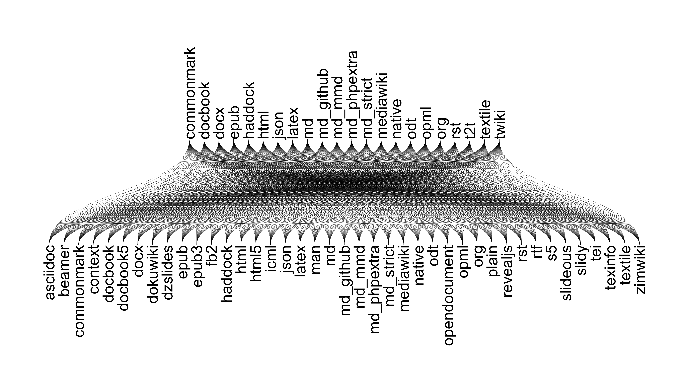
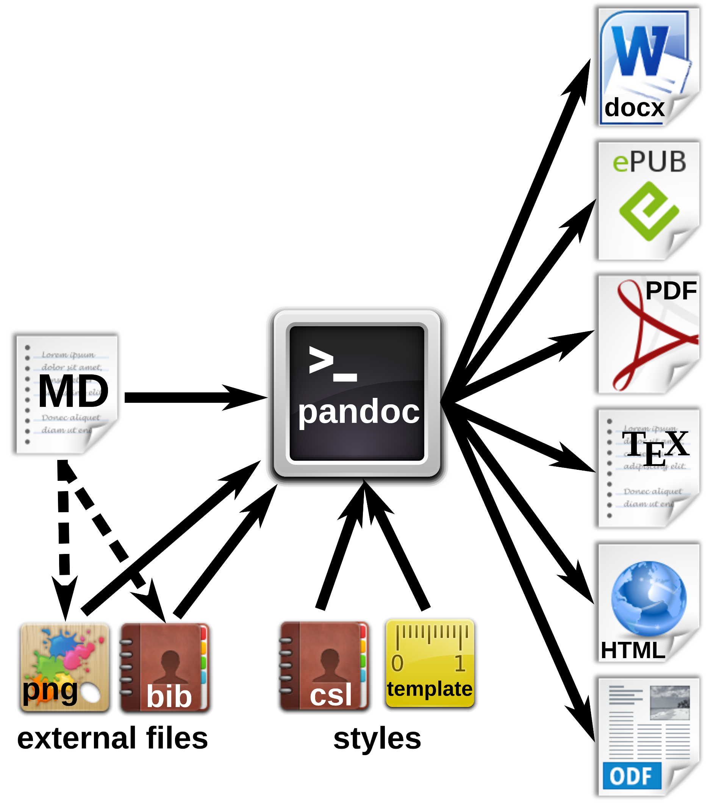

# What are dynamic documents?

Reproducible ways of communicating data science results.


# The parable of the old dataset

```
Karl -- this is very interesting,
however you used an old version of
the data (n=143 rather than n=226).

I'm really sorry you did all that
work on the incomplete dataset.

Bruce
```

_"The dreaded email." By [Karl Broman](https://www.biostat.wisc.edu/~kbroman/presentations/repro_research_JSM2016.pdf)._

# Examples of dynamic documents

- Supplemental materials
- Entire manuscripts. e.g., [papaja](https://github.com/crsh/papaja)
- Preregistrations
- Multi-lab projects. e.g., ["Many Labs"](https://osf.io/wx7ck/)

_When dynamic documents are published with the intention of being updated, we call them "evergreen hypotheses"._

# Dynamic documents are written in markup languages

Example markup languages:

- wiki
- Markdown
- Github flavored Markdown
- CommonMark
- **Rmarkdown**
- YAML
- TOML

**Jupyter notebooks**: python + markdown = JSON??

# pandoc

> Wouldn't it be great to have a universal document converter?  
-- John MacFarlane, Professor of Philosophy, UC-Berkeley

```bash
pandoc -f markdown -t docx game-of-thrones-fan-fic.md
```

# pandoc formats



# A more typical pandoc workflow



# pandoc citations

```
[1] Blah blah [@smith04; @doe99].
[2] Blah blah [see @doe99, pp. 33-35; also @smith04, chap. 1].
[3] Blah blah [@doe99, pp. 33-35, 38-39 and *passim*].
[4] Smith says blah [-@smith04].
[5] @smith04 says blah.
[6] @smith04 [p. 33] says blah.
```

# Rmarkdown

```
library(rmarkdown)
render("manuscript.Rmd")
# Rmd -[knitr]-> md -[pandoc]-> [docx, pdf, html]
```
